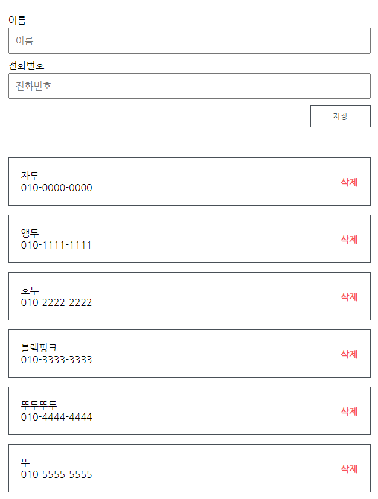

## 👷 React 개발 환경 구성
### 1. Node.js
: react project를 구동시키기 위해서 필수적으로 설치해야 함.
#### 1) Node.js 다운로드
: https://nodejs.org/ko/

- 설치 확인
```
node -v
npm -v
```

#### 2) Yarn
: npm보다 yarn이 빠르고, 안정적이기 때문에 되도록 설치하기.
> 굳이 안해도 된다.

### 2. create-react-app
: 간단한 react 개발 환경 구성을 위한 라이브러리.
``` t
# npm을 사용한 설치
npm install -g create-react-app
# yarn을 사용한 설치
yarn global add create-react-app
```

### 3. 프로젝트 생성하기
```
create-react-app [프로젝트 이름]
```

### 4. 프로젝트 실행하기
``` t
cd [프로젝트 이름]
# npm을 사용한 실행
npm run start
# yarn을 사용한 실행
yarn start
```

### 5. 프로젝트 초기 설정
```
[프로젝트 이름]
- node_modules
- public
- src
    - App.css
    - App.js
    - App.test.js
    - index.css
    - index.js
    - logo.svg
    - serviceWorker.js
    - setupTests.js
- package.json
- README.md
- yarn.lock
```
: 사용하지 않는 파일 지우기
> 이 프로젝트에서는 ```App.test.js```, ```index.css```, ```logo.svg``` 파일 지우기\
> index.js 파일에서 ```"import './index.css';"``` 없애기

### 6. ```index.js```
: App 컴포넌트를 root라는 id를 가진 element에 render하라
> root라는 id는 ```public/index.html```에 있음.\
> App 컴포넌트는 App.js
``` js
ReactDOM.render(
  <React.StrictMode>
    <App />
  </React.StrictMode>,
  document.getElementById('root')
);
```

---

### 🍕 PhoneItem컴포넌트
1. App 컴포넌트\
: 렌더링할 컴포넌트로 components 디렉토리에 있는 PhoneList 컴포넌트와 InputBox 컴포넌트를 포함할 것.
2. PhoneList 컴포넌트\
: 여러 개의 PhoneItem 컴포넌트를 띄워 줄 것.
3. PhoneItem 컴포넌트\
: 이름, 전화번호, 삭제 버튼을 가진 컴포넌트.
4. InputBox 컴포넌트\
:  이름과 전화번호를 입력받는 폼이 있는 컴포넌트.

